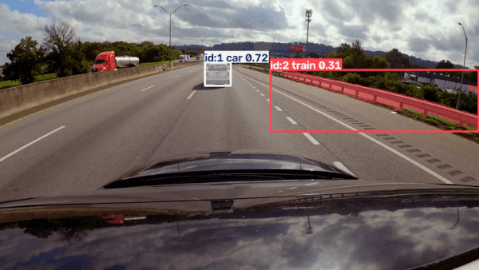
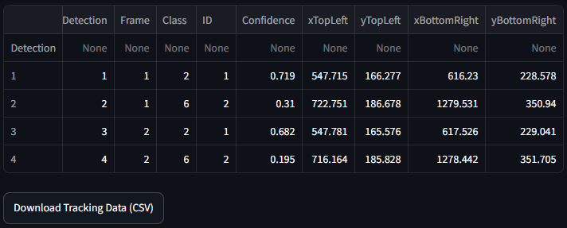

# Dashcam Infrastructure & Multi-Object Tracker

An end-to-end computer vision pipeline designed to extract structured traffic flow and infrastructure data from unstructured dashcam video. Built to demonstrate deployable AI for civil engineering and road condition monitoring, this application bridges the gap between raw pixel data and actionable municipal analytics.

*Demo applied on dashcam video provided by the user K from Pexels: https://www.pexels.com/video/cars-traveling-on-expressway-5382495/*

*Screenshot of the live telemetry extraction in the Streamlit UI:*

## Core Architecture

 - **Persistent Multi-Object Tracking (MOT):** Integrates YOLOv8 object detection with the ByteTrack algorithm to ensure consistent tracking of vehicles, pedestrians, and infrastructure assets across sequential frames, minimizing ID switching.
 - **Web-Native Video Encoding:** Implemented the VP80 codec natively in OpenCV, allowing the Streamlit frontend to render processed tracking video dynamically in any modern web browser.
 - **Telemetry Extraction Layer:** Automatically parses bounding box coordinates, confidence scores, and tracking IDs into relational pandas dataframes, creating a structured foundation for downstream spatial analysis.
 - **Continuous Deployment:** Fully managed via GitHub CD and hosted on Streamlit for instant stakeholder access.
